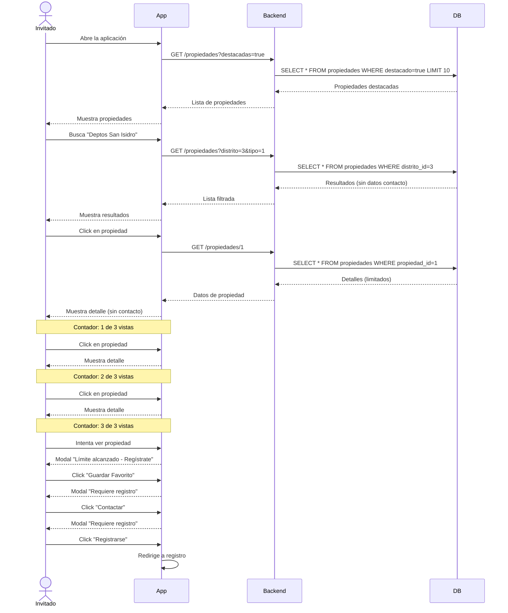

# 👤 FLUJO: USUARIO INVITADO

## 🎯 Objetivo
Permitir que usuarios no registrados exploren propiedades de manera limitada para incentivar el registro.

---

## 📊 Diagrama de Flujo

```
┌─────────────────┐
│  Usuario llega  │
│   a la app      │
└────────┬────────┘
         │
         ▼
┌─────────────────────────┐
│  Pantalla de Bienvenida │
│  - Ver propiedades      │
│  - Búsqueda básica      │
└────────┬────────────────┘
         │
         ▼
    ┌────────┐
    │ Acción │
    └───┬────┘
        │
        ├─── Ver Propiedad ──────► Puede ver hasta 3 propiedades
        │                          └─► Luego pide registro
        │
        ├─── Buscar ───────────────► Búsqueda limitada (sin filtros avanzados)
        │
        ├─── Contactar ────────────► ❌ Requiere registro
        │
        ├─── Guardar Favorito ─────► ❌ Requiere registro
        │
        ├─── Guardar Búsqueda ─────► ❌ Requiere registro
        │
        └─── Registrarse ──────────► Va a flujo 02_registro_usuario.md
```

---

## 🔄 Diagrama de Secuencia



---

## ✅ Permisos del Usuario Invitado

### 🟢 Puede Hacer:
- ✅ Ver listado de propiedades (máximo 3 detalles completos)
- ✅ Búsqueda básica por distrito y tipo
- ✅ Ver precios y ubicación general
- ✅ Ver imágenes principales

### 🔴 NO Puede Hacer:
- ❌ Ver datos de contacto del propietario/corredor
- ❌ Enviar mensajes o consultas
- ❌ Guardar favoritos (lo invita a registrarse)
- ❌ Guardar búsquedas (lo invita a registrarse)
- ❌ Ver historial de búsquedas
- ❌ Acceder a filtros avanzados
- ❌ Ver todas las imágenes de la propiedad
- ❌ Registrar propiedades

---

## 🔔 Mensajes al Usuario Invitado

### Después de ver 3 propiedades:
```
🔒 ¡Regístrate para seguir explorando!

Has alcanzado el límite de visualización.
Crea tu cuenta GRATIS para:
  ✅ Ver propiedades ilimitadas
  ✅ Contactar directamente
  ✅ Guardar favoritos
  ✅ Recibir alertas personalizadas

[Registrarse Ahora] [Iniciar Sesión]
```

### Al intentar contactar:
```
🔒 Registro requerido

Para contactar al propietario necesitas una cuenta.
Es GRATIS y toma solo 2 minutos.

[Crear Cuenta] [Ya tengo cuenta]
```

### Al intentar guardar favorito:
```
🔒 Regístrate para guardar favoritos

Crea tu cuenta GRATIS para:
  ✅ Guardar propiedades favoritas
  ✅ Guardar tus búsquedas
  ✅ Recibir alertas personalizadas
  ✅ Contactar propietarios

[Registrarse Ahora] [Iniciar Sesión]
```

### Al intentar guardar búsqueda:
```
🔒 Guarda tus búsquedas

Regístrate para guardar esta búsqueda y
recibir notificaciones de nuevas propiedades.

[Crear Cuenta Gratis]
```

---

## 📱 Pantallas

### 1. Home - Usuario Invitado
- Banner: "Regístrate gratis y encuentra tu propiedad ideal"
- Listado de propiedades destacadas
- Barra de búsqueda básica
- Botón: "Registrarse" (destacado)

### 2. Detalle de Propiedad (Limitado)
- Imágenes: Solo la principal
- Precio: Visible
- Ubicación: Solo distrito (no dirección exacta)
- Características: Básicas (área, habitaciones, baños)
- Contacto: Botón "Registrarse para contactar"

---

## 🎯 Objetivo de Conversión
**Convertir al usuario invitado en usuario registrado** mostrando el valor de la plataforma pero limitando funcionalidades clave.

---

## 🔄 Siguiente Paso
➡️ [Flujo 02: Registro de Usuario](./02_registro_usuario.md)
