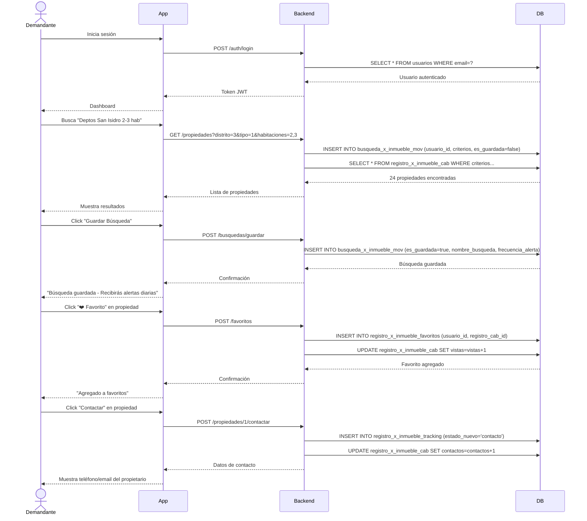

# 🔍 FLUJO: USUARIO DEMANDANTE/BUSCADOR

## 🎯 Objetivo
Permitir que usuarios busquen propiedades, contacten propietarios/corredores, y gestionen sus búsquedas favoritas. **IMPORTANTE**: Un demandante también puede registrar UNA propiedad propia si decide vender/alquilar.

---

## 📊 Diagrama de Flujo Principal

```
┌──────────────────┐
│ Usuario          │
│ Demandante       │
│ inicia sesión    │
└────────┬─────────┘
         │
         ▼
┌─────────────────────────┐
│ Dashboard Demandante    │
│ - Búsquedas guardadas   │
│ - Favoritos             │
│ - Alertas activas       │
│ - Mis consultas         │
└────────┬────────────────┘
         │
         ▼
    ┌────────┐
    │ Acción │
    └───┬────┘
        │
        ├─── Buscar Propiedades ────► [Ver flujo detallado]
        │
        ├─── Ver Favoritos ─────────► Lista de propiedades guardadas
        │
        ├─── Contactar ─────────────► Enviar mensaje/llamar
        │
        ├─── Crear Alerta ──────────► Notificaciones automáticas
        │
        └─── Registrar MI Propiedad ► [Caso especial - ver abajo]
```

---

## 🔄 Diagrama de Secuencia - Búsqueda y Favoritos



---

## ✅ Permisos del Usuario Demandante

### 🟢 Puede Hacer:
- ✅ Buscar propiedades ilimitadas
- ✅ Usar todos los filtros avanzados
- ✅ Ver información completa de propiedades
- ✅ Contactar propietarios y corredores
- ✅ Guardar favoritos ilimitados
- ✅ Crear alertas de búsqueda
- ✅ Ver historial de búsquedas
- ✅ Registrar UNA propiedad propia (si decide vender/alquilar)

### 🔴 NO Puede Hacer:
- ❌ Registrar propiedades de terceros
- ❌ Operar como corredor
- ❌ Publicar múltiples propiedades (sin cambiar a Propietario)
- ❌ Acceder a panel de corredor

---

## 🔍 FLUJO: Búsqueda de Propiedades

### Pantalla de Búsqueda:

```
┌─────────────────────────────────────────────────────────┐
│ 🔍 BUSCAR PROPIEDADES                                   │
├─────────────────────────────────────────────────────────┤
│                                                         │
│ 📍 Ubicación:  [San Isidro ▼]                          │
│                                                         │
│ 🏠 Tipo:       [Departamento ▼]                        │
│                                                         │
│ 💰 Precio:     [S/ 500] ──────────── [S/ 3000]         │
│                                                         │
│ 📐 Área:       [50 m²] ──────────── [200 m²]           │
│                                                         │
│ 🛏️  Habitaciones: [ ] 1  [✓] 2  [✓] 3  [ ] 4+         │
│                                                         │
│ 🚗 Parqueos:    [ ] 0  [✓] 1  [ ] 2+                   │
│                                                         │
│ ⚙️  Características:                                    │
│    [✓] Amoblado  [✓] Mascotas  [ ] Piscina            │
│                                                         │
│ [🔍 Buscar]  [💾 Guardar Búsqueda]  [🔔 Crear Alerta] │
│                                                         │
└─────────────────────────────────────────────────────────┘
```

### Resultados:

```
┌─────────────────────────────────────────────────────────┐
│ 📊 RESULTADOS (24 propiedades)                          │
│                                                         │
│ Ordenar por: [Más Recientes ▼]                         │
│                                                         │
├─────────────────────────────────────────────────────────┤
│                                                         │
│ 🏠 [Imagen]  Departamento en San Isidro                │
│              2 hab • 2 baños • 85 m² • 1 parqueo       │
│              S/ 1,800/mes                               │
│              📍 Av. Javier Prado 123                    │
│              ⭐ Destacado                                │
│                                                         │
│              [❤️ Favorito] [👁️ Ver] [📞 Contactar]     │
│                                                         │
├─────────────────────────────────────────────────────────┤
│                                                         │
│ 🏠 [Imagen]  Departamento amoblado                     │
│              3 hab • 2 baños • 120 m² • 2 parqueos     │
│              S/ 2,500/mes                               │
│              📍 Calle Los Pinos 456                     │
│                                                         │
│              [❤️ Favorito] [👁️ Ver] [📞 Contactar]     │
│                                                         │
└─────────────────────────────────────────────────────────┘
```

### Registro en BD:
```sql
INSERT INTO busqueda_x_inmueble_mov (
  usuario_id,
  tipo_inmueble_id,
  distrito_id,
  precio_min,
  precio_max,
  area_min,
  area_max,
  habitaciones,
  parqueos,
  caracteristicas,
  resultados_encontrados,
  created_at
) VALUES (
  5,  -- usuario demandante
  1,  -- departamento
  3,  -- San Isidro
  500,
  3000,
  50,
  200,
  ARRAY[2, 3],
  ARRAY[1],
  '{"amoblado": true, "mascotas": true}',
  24,
  NOW()
);
```

---

## ❤️ FLUJO: Guardar Favoritos

### Acción:
Usuario hace clic en "❤️ Favorito" en una propiedad

### Pantalla de Confirmación:
```
┌─────────────────────────────────┐
│ ❤️ AGREGAR A FAVORITOS          │
├─────────────────────────────────┤
│                                 │
│ Departamento en San Isidro      │
│ S/ 1,800/mes                    │
│                                 │
│ 📝 Nota personal (opcional):    │
│ [Me gusta la ubicación]         │
│                                 │
│ [✓ Guardar] [Cancelar]          │
│                                 │
└─────────────────────────────────┘
```

### Registro en BD:
```sql
INSERT INTO favoritos (
  usuario_id,
  propiedad_id,
  nota,
  created_at
) VALUES (
  5,  -- usuario demandante
  12, -- propiedad
  'Me gusta la ubicación',
  NOW()
);
```

### Mis Favoritos:
```
┌─────────────────────────────────────────────────────────┐
│ ❤️ MIS FAVORITOS (8)                                    │
├─────────────────────────────────────────────────────────┤
│                                                         │
│ 🏠 Departamento en San Isidro                           │
│    S/ 1,800/mes • Agregado hace 2 días                 │
│    📝 "Me gusta la ubicación"                           │
│    [👁️ Ver] [🗑️ Quitar] [📞 Contactar]                 │
│                                                         │
├─────────────────────────────────────────────────────────┤
│                                                         │
│ 🏠 Casa en Miraflores                                   │
│    S/ 3,500/mes • Agregado hace 5 días                 │
│    [👁️ Ver] [🗑️ Quitar] [📞 Contactar]                 │
│                                                         │
└─────────────────────────────────────────────────────────┘
```

---

## 📞 FLUJO: Contactar Propietario/Corredor

### Detalle de Propiedad:
```
┌─────────────────────────────────────────────────────────┐
│ 🏠 DEPARTAMENTO EN SAN ISIDRO                           │
├─────────────────────────────────────────────────────────┤
│                                                         │
│ [Galería de Imágenes]                                   │
│                                                         │
│ S/ 1,800/mes                                            │
│ 2 hab • 2 baños • 85 m² • 1 parqueo                    │
│ 📍 Av. Javier Prado 123, San Isidro                    │
│                                                         │
│ 📋 Características:                                     │
│ ✅ Amoblado  ✅ Mascotas  ✅ Seguridad 24h             │
│                                                         │
│ ━━━━━━━━━━━━━━━━━━━━━━━━━━━━━━━━━━━━━━━━━━━━━━━━━━━━ │
│                                                         │
│ 👤 CONTACTO                                             │
│                                                         │
│    Juan Pérez (Propietario)                            │
│    📞 +51 999 888 777                                   │
│    📧 juan.perez@email.com                              │
│                                                         │
│    [📞 Llamar] [💬 Enviar Mensaje] [📧 Email]          │
│                                                         │
└─────────────────────────────────────────────────────────┘
```

### Modal: Enviar Mensaje
```
┌─────────────────────────────────────────┐
│ 💬 CONTACTAR AL PROPIETARIO             │
├─────────────────────────────────────────┤
│                                         │
│ Para: Juan Pérez                        │
│ Propiedad: Depto San Isidro - S/ 1,800 │
│                                         │
│ Mensaje:                                │
│ ┌─────────────────────────────────────┐ │
│ │ Hola, me interesa la propiedad.     │ │
│ │ ¿Está disponible para visita?       │ │
│ │                                     │ │
│ └─────────────────────────────────────┘ │
│                                         │
│ Tu contacto:                            │
│ 📞 +51 987 654 321                      │
│ 📧 maria.lopez@email.com                │
│                                         │
│ [✓ Enviar] [Cancelar]                   │
│                                         │
└─────────────────────────────────────────┘
```

### Registro en BD:
```sql
INSERT INTO registro_x_inmueble_mov (
  usuario_id,
  propiedad_id,
  tipo_interaccion,
  mensaje,
  contacto_usuario,
  created_at
) VALUES (
  5,  -- usuario demandante
  12, -- propiedad
  'mensaje',
  'Hola, me interesa la propiedad. ¿Está disponible para visita?',
  '{"telefono": "+51 987 654 321", "email": "maria.lopez@email.com"}',
  NOW()
);

-- Actualizar contador de contactos en la propiedad
UPDATE propiedades 
SET contactos = contactos + 1 
WHERE propiedad_id = 12;
```

---

## 🔔 FLUJO: Guardar Búsqueda y Crear Alerta

### Pantalla:
```
┌─────────────────────────────────────────────────────────┐
│ 💾 GUARDAR BÚSQUEDA Y CREAR ALERTA                      │
├─────────────────────────────────────────────────────────┤
│                                                         │
│ Guarda esta búsqueda y recibe notificaciones cuando    │
│ haya nuevas propiedades que coincidan.                  │
│                                                         │
│ Criterios de búsqueda:                                  │
│ ━━━━━━━━━━━━━━━━━━━━━━━━━━━━━━━━━━━━━━━━━━━━━━━━━━━━ │
│                                                         │
│ 📍 Distrito: San Isidro                                 │
│ 🏠 Tipo: Departamento                                   │
│ 💰 Precio: S/ 500 - S/ 3,000                           │
│ 📐 Área: 50 - 200 m²                                    │
│ 🛏️  Habitaciones: 2-3                                   │
│ 🚗 Parqueos: 1                                          │
│ ✅ Características: Amoblado, Mascotas                  │
│                                                         │
│ ━━━━━━━━━━━━━━━━━━━━━━━━━━━━━━━━━━━━━━━━━━━━━━━━━━━━ │
│                                                         │
│ Nombre de la búsqueda: *                                │
│ [Deptos San Isidro 2-3 hab]                            │
│                                                         │
│ Frecuencia de alertas:                                  │
│ ( ) Inmediata (cada nueva propiedad)                   │
│ (•) Diaria (resumen diario a las 8 AM)                 │
│ ( ) Semanal (resumen semanal los lunes)                │
│                                                         │
│ Resultados actuales: 12 propiedades                     │
│                                                         │
│ [✓ Guardar Búsqueda] [Cancelar]                        │
│                                                         │
└─────────────────────────────────────────────────────────┘
```

### Registro en BD:
```sql
-- Se guarda en busqueda_x_inmueble_mov con es_guardada = true
INSERT INTO busqueda_x_inmueble_mov (
  usuario_id,
  tipo_inmueble_id,
  distritos_ids,
  transaccion,
  precio_min,
  precio_max,
  area_min,
  area_max,
  habitaciones,
  parqueos_min,
  filtros_avanzados,
  cantidad_resultados,
  es_guardada,
  nombre_busqueda,
  frecuencia_alerta,
  alerta_activa,
  fecha_busqueda
) VALUES (
  5,
  1,
  ARRAY[3],
  'alquiler',
  500,
  3000,
  50,
  200,
  ARRAY[2, 3],
  1,
  '{"amoblado": true, "mascotas": true}',
  12,
  true,
  'Deptos San Isidro 2-3 hab',
  'diaria',
  true,
  NOW()
);
```

### Mis Búsquedas Guardadas:
```
┌─────────────────────────────────────────────────────────┐
│ 💾 MIS BÚSQUEDAS GUARDADAS (3)                          │
├─────────────────────────────────────────────────────────┤
│                                                         │
│ 🔔 Deptos San Isidro 2-3 hab                            │
│    Alertas: Diarias                                     │
│    Resultados: 12 propiedades                           │
│    Última alerta: Hoy, 8:00 AM                          │
│    [Ver Resultados] [Editar] [Pausar] [Eliminar]       │
│                                                         │
├─────────────────────────────────────────────────────────┤
│                                                         │
│ 🔔 Casas Miraflores con jardín                          │
│    Alertas: Semanales                                   │
│    Resultados: 8 propiedades                            │
│    Última alerta: Lunes, 8:00 AM                        │
│    [Ver Resultados] [Editar] [Pausar] [Eliminar]       │
│                                                         │
├─────────────────────────────────────────────────────────┤
│                                                         │
│ ⏸️ Oficinas San Isidro (Pausada)                        │
│    Alertas: Inmediatas                                  │
│    Resultados: 5 propiedades                            │
│    [Reactivar] [Eliminar]                               │
│                                                         │
└─────────────────────────────────────────────────────────┘
```

---

## 🏠 CASO ESPECIAL: Demandante Registra SU Propiedad

### Escenario:
Un usuario que estaba buscando propiedades decide vender/alquilar su propia propiedad.

### Flujo:
```
┌──────────────────────┐
│ Usuario Demandante   │
│ hace clic en         │
│ "Publicar Propiedad" │
└──────────┬───────────┘
           │
           ▼
┌─────────────────────────────┐
│ Sistema detecta:            │
│ - Usuario es Demandante     │
│ - No tiene propiedades      │
└──────────┬──────────────────┘
           │
           ▼
┌─────────────────────────────┐
│ Modal de Confirmación:      │
│                             │
│ "¿Es tu propiedad?"         │
│ [✓ Sí, es mía]              │
│ [No, soy corredor]          │
└──────────┬──────────────────┘
           │
           ├─── Sí, es mía ──────► Permite registro
           │                       └─► Solicita documentos
           │
           └─── No, soy corredor ► Redirige a solicitud
                                   de cambio de perfil
```

### Modal de Confirmación:
```
┌─────────────────────────────────────────┐
│ 🏠 PUBLICAR TU PROPIEDAD                │
├─────────────────────────────────────────┤
│                                         │
│ Antes de continuar, confirma:           │
│                                         │
│ ¿Esta propiedad es TUYA?                │
│                                         │
│ (•) Sí, soy el propietario              │
│     Puedo demostrarlo con documentos    │
│                                         │
│ ( ) No, represento al propietario       │
│     Necesito perfil de Corredor         │
│                                         │
│ ⚠️  IMPORTANTE:                         │
│ Publicar propiedades ajenas sin         │
│ autorización está prohibido y           │
│ resultará en suspensión de cuenta.      │
│                                         │
│ [Continuar] [Cancelar]                  │
│                                         │
└─────────────────────────────────────────┘
```

### Si confirma "Es mía":
```
┌─────────────────────────────────────────┐
│ 📄 DOCUMENTOS REQUERIDOS                │
├─────────────────────────────────────────┤
│                                         │
│ Para publicar tu propiedad necesitamos: │
│                                         │
│ 1. ✅ DNI o RUC                         │
│    [Subir documento]                    │
│                                         │
│ 2. 📋 Documento de propiedad            │
│    (Escritura, contrato, etc.)          │
│    [Subir documento]                    │
│                                         │
│ Estos documentos serán validados        │
│ antes de publicar tu propiedad.         │
│                                         │
│ Tiempo de validación: 24-48 horas       │
│                                         │
│ [Subir Documentos] [Más Tarde]          │
│                                         │
└─────────────────────────────────────────┘
```

### Límite:
- ✅ Puede registrar **1 propiedad** como Demandante
- ⚠️ Si quiere registrar más, debe cambiar a perfil **Propietario**

---

## 📊 Dashboard del Demandante

```
┌─────────────────────────────────────────────────────────┐
│ 👋 Hola, María                                          │
├─────────────────────────────────────────────────────────┤
│                                                         │
│ 🔍 MIS BÚSQUEDAS RECIENTES (3)                          │
│    • Deptos en San Isidro - hace 2 horas               │
│    • Casas en Miraflores - hace 1 día                  │
│                                                         │
│ 💾 BÚSQUEDAS GUARDADAS (3)                              │
│    • Deptos San Isidro 2-3 hab (12 resultados)         │
│    • Casas Miraflores con jardín (8 resultados)        │
│    [Ver todas]                                          │
│                                                         │
│ ❤️ FAVORITOS (8)                                        │
│    [Ver todos]                                          │
│                                                         │
│ 📞 MIS CONSULTAS (5)                                    │
│    • Depto Av. Javier Prado - Respuesta pendiente      │
│    • Casa Los Pinos - Respondido hace 1 hora           │
│                                                         │
│ 🏠 MI PROPIEDAD (0)                                     │
│    [+ Publicar mi propiedad]                            │
│                                                         │
└─────────────────────────────────────────────────────────┘
```

---

## 🔄 Siguiente Paso
➡️ [Flujo 08: Registro de Propiedad por Propietario](./08_registro_propiedad_propietario.md)
