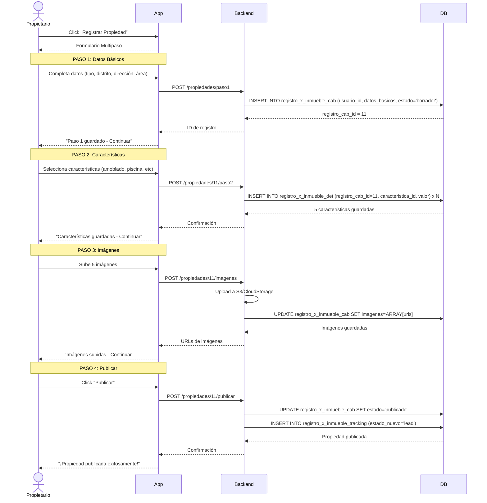

# 🏠 FLUJO: USUARIO PROPIETARIO

## 🎯 Objetivo
Permitir que propietarios registren y gestionen sus propiedades de manera profesional, con validación de documentos y seguimiento de interacciones.

---

## 📊 Diagrama de Flujo Principal

```
Usuario Propietario → Dashboard → Acciones:
  ├─ Registrar Propiedad
  ├─ Gestionar Propiedades
  ├─ Ver Consultas
  ├─ Ver Estadísticas
  ├─ Buscar Corredor
  └─ Buscar Propiedades
```

---

## 🔄 Diagrama de Secuencia - Registro de Propiedad



---

## ✅ Permisos del Usuario Propietario

### Puede Hacer:
- ✅ Registrar múltiples propiedades PROPIAS
- ✅ Editar y gestionar sus propiedades
- ✅ Ver estadísticas detalladas
- ✅ Responder consultas de interesados
- ✅ Pausar/Reactivar publicaciones
- ✅ Buscar y contratar corredores
- ✅ Buscar otras propiedades
- ✅ Subir documentos de propiedad

### NO Puede Hacer:
- ❌ Registrar propiedades de terceros
- ❌ Operar como corredor sin licencia

---

## 📊 Dashboard del Propietario

### Resumen:
- Propiedades: 3
- Vistas totales: 245
- Consultas: 18

### Mis Propiedades:
1. Departamento en San Isidro
   - S/ 1,800/mes
   - 89 vistas, 7 consultas
   - Estado: Activo

2. Casa en Miraflores
   - S/ 3,500/mes
   - 156 vistas, 11 consultas
   - Estado: Activo

### Consultas Recientes:
- María López: "¿Está disponible para visita?"
- Carlos Ruiz: "¿Acepta mascotas?" (Respondido)

---

## 🏠 Gestión de Propiedades

### Acciones Disponibles:

#### 1. Editar Propiedad
- Cambiar precio
- Actualizar descripción
- Agregar/quitar fotos
- Modificar características

#### 2. Pausar Publicación
- Oculta la propiedad temporalmente
- No se elimina, se puede reactivar
- Útil cuando está en proceso de alquiler

#### 3. Marcar como Alquilado/Vendido
- Cambia estado a "alquilado" o "vendido"
- Se archiva automáticamente
- Mantiene historial de estadísticas

#### 4. Eliminar Propiedad
- Eliminación permanente
- Requiere confirmación
- Se pierde todo el historial

---

## 📊 Estadísticas Detalladas

### Por Propiedad:
```
Departamento en San Isidro
Publicado: 15 días

Vistas: 89
  - Últimos 7 días: 23
  - Promedio diario: 6

Contactos: 7
  - Mensajes: 5
  - Llamadas: 2

Favoritos: 12 usuarios

Tasa de conversión: 7.9%
```

### Gráficos:
- Vistas por día (últimos 30 días)
- Consultas por semana
- Comparación con propiedades similares

---

## 📞 Gestión de Consultas

### Bandeja de Entrada:
```
Consulta #1 - María López
Propiedad: Depto San Isidro
Fecha: Hoy, 10:30 AM

"Hola, me interesa la propiedad. 
¿Está disponible para visita este fin de semana?"

Contacto:
📞 +51 987 654 321
📧 maria.lopez@email.com

[Responder] [Marcar como leída] [Archivar]
```

### Responder:
```
Para: María López
Re: Depto San Isidro

[Plantilla: Agendar visita]

Hola María,

Gracias por tu interés. La propiedad está disponible.

¿Te viene bien el sábado a las 3 PM?

Saludos,
Juan Pérez
📞 +51 999 888 777

[Enviar] [Guardar borrador]
```

---

## 🤝 Buscar y Contratar Corredor

### Escenario:
Propietario quiere ayuda profesional para vender/alquilar

### Pantalla:
```
CORREDORES DISPONIBLES

Filtros:
- Zona: San Isidro
- Especialidad: Departamentos
- Calificación: 4+ estrellas

Resultados (8):

1. Carlos Ruiz - Corredor Certificado
   ⭐⭐⭐⭐⭐ (4.8) - 45 operaciones
   Especialidad: Departamentos en San Isidro
   Comisión: 5%
   [Ver perfil] [Contactar]

2. Ana Torres - Corredora Senior
   ⭐⭐⭐⭐ (4.5) - 32 operaciones
   Especialidad: Propiedades premium
   Comisión: 6%
   [Ver perfil] [Contactar]
```

### Contactar Corredor:
```
Solicitud de Servicio

Para: Carlos Ruiz
Propiedad: Depto San Isidro - S/ 1,800/mes

Mensaje:
"Hola Carlos, me gustaría que me ayudes a 
alquilar mi departamento. ¿Podemos coordinar?"

Términos:
☑️ Acepto comisión del 5%
☑️ Contrato por 3 meses
☑️ El corredor puede publicar en mi nombre

[Enviar Solicitud]
```

### Registro en BD:
```sql
INSERT INTO solicitud_corredor (
  propietario_id,
  corredor_id,
  propiedad_id,
  comision_acordada,
  duracion_contrato,
  estado,
  created_at
) VALUES (
  3,  -- propietario
  8,  -- corredor
  12, -- propiedad
  5.0,
  90, -- días
  'pendiente',
  NOW()
);
```

---

## 📄 Gestión de Documentos

### Mis Documentos:
```
DOCUMENTOS VERIFICADOS

DNI: ✅ Verificado
  Juan Pérez García
  DNI: 12345678
  Subido: 15/01/2024

Propiedades:

1. Depto San Isidro
   Escritura: ✅ Verificada
   Fecha: 20/01/2024

2. Casa Miraflores
   Escritura: ⏳ En revisión
   Fecha: 25/01/2024

[+ Subir nuevo documento]
```

### Subir Documento:
```
SUBIR DOCUMENTO DE PROPIEDAD

Propiedad: Casa Miraflores

Tipo de documento:
(•) Escritura pública
( ) Contrato de compraventa
( ) Título de propiedad

Archivo:
[Seleccionar archivo] (PDF, JPG, PNG - Max 5MB)

[Subir] [Cancelar]
```

---

## 🔔 Notificaciones

### Push/Email:
- Nueva consulta recibida
- Propiedad marcada como favorita
- Documento verificado
- Corredor aceptó solicitud
- Alerta: Propiedad sin vistas (7 días)

---

## 📱 Funciones Adicionales

### 1. Buscar Propiedades
Propietario también puede buscar (como demandante)

### 2. Comparar Precios
Ver propiedades similares en la zona

### 3. Sugerencias de Precio
Sistema sugiere precio basado en mercado

### 4. Promocionar Propiedad
Destacar propiedad (plan premium)

---

## 🔄 Siguiente Paso
➡️ [Flujo 08: Registro de Propiedad por Propietario](./08_registro_propiedad_propietario.md)
