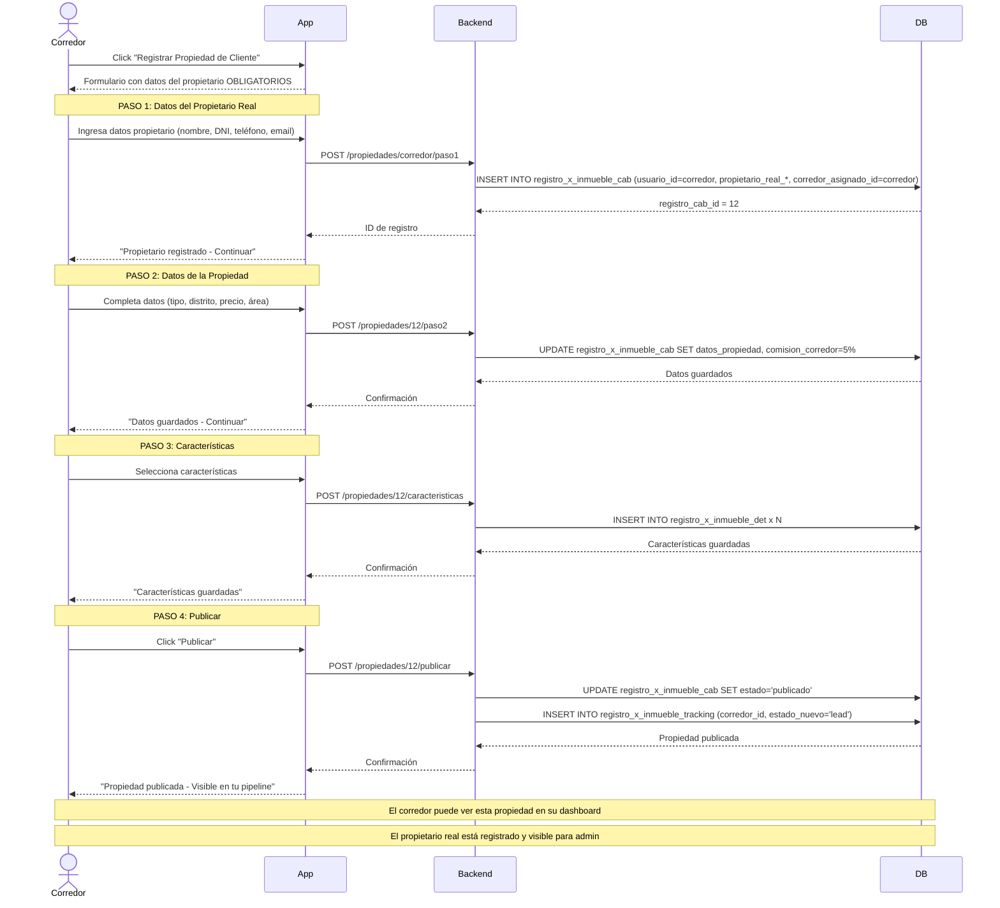

# 🤝 FLUJO: USUARIO CORREDOR

## 🎯 Objetivo
Regular y profesionalizar el trabajo de corredores inmobiliarios, exigiendo transparencia total sobre el propietario real de cada propiedad.

---

## 🚨 PRINCIPIO FUNDAMENTAL

**UN CORREDOR NUNCA PUEDE REGISTRAR UNA PROPIEDAD COMO PROPIA**

Debe SIEMPRE declarar:
- Nombre completo del propietario real
- Documento de identidad del propietario
- Autorización firmada
- Términos de comisión claros

---

## 📊 Diagrama de Flujo Principal

```
Usuario Corredor → Dashboard → Acciones:
  ├─ Registrar Propiedad de Cliente
  │  └─ REQUIERE: Datos del propietario
  ├─ Gestionar Propiedades Asignadas
  ├─ Ver Pipeline CRM
  ├─ Responder Consultas
  ├─ Gestionar Comisiones
  ├─ Buscar Propiedades
  └─ Buscar Propietarios (clientes)
```

---

## 🔄 Diagrama de Secuencia - Corredor Registra Propiedad de Cliente



---

## ✅ Permisos del Usuario Corredor

### Puede Hacer:
- ✅ Registrar propiedades DE TERCEROS (con autorización)
- ✅ Gestionar propiedades asignadas
- ✅ Ver y gestionar pipeline CRM completo
- ✅ Responder consultas en nombre del propietario
- ✅ Coordinar visitas
- ✅ Buscar propiedades (como demandante)
- ✅ Buscar propietarios que necesiten servicios
- ✅ Gestionar comisiones y contratos

### NO Puede Hacer:
- ❌ Registrar propiedades sin datos del propietario
- ❌ Ocultar información del propietario al sistema
- ❌ Modificar términos sin autorización
- ❌ Operar sin licencia vigente

---

## 📊 Dashboard del Corredor

```
Hola, Carlos Ruiz
Corredor Certificado
Licencia: CIP-12345 (Vigente hasta: 31/12/2025)

RESUMEN DEL MES
- Propiedades activas: 8
- Leads: 15
- En negociación: 4
- Cerrados este mes: 2
- Comisiones generadas: S/ 4,500

PIPELINE CRM
Lead (15) → Contacto (8) → Propuesta (5) → Negociación (4) → Cierre (2)

MIS PROPIEDADES (8)

1. Depto San Isidro - S/ 1,800/mes
   Propietario: Juan Pérez
   Estado CRM: Negociación
   Leads: 3 activos
   [Gestionar]

2. Casa Miraflores - S/ 3,500/mes
   Propietario: María López
   Estado CRM: Propuesta
   Leads: 2 activos
   [Gestionar]

[+ Registrar Nueva Propiedad]

SOLICITUDES PENDIENTES (2)
- Juan Pérez solicita ayuda para Depto San Isidro
- Ana Torres quiere vender Casa Surco

TAREAS HOY
- Visita: Depto San Isidro - 3:00 PM
- Seguimiento: Lead María Gómez
- Enviar propuesta: Casa Miraflores
```

---

## 🏠 FLUJO: Registrar Propiedad de Cliente

### PASO 1: Datos del Propietario (OBLIGATORIO)

```
REGISTRAR NUEVA PROPIEDAD

PASO 1/4: DATOS DEL PROPIETARIO REAL

⚠️ IMPORTANTE: Debes declarar al propietario real.
   Ocultar esta información viola nuestros términos.

Propietario:
- Nombre completo: [Juan Pérez García]
- DNI/RUC: [12345678]
- Teléfono: [+51 999 888 777]
- Email: [juan.perez@email.com]

¿El propietario está registrado en la plataforma?
( ) Sí - Buscar usuario existente
(•) No - Crear registro como propietario

Autorización:
☑️ Tengo autorización firmada del propietario
☑️ El propietario conoce los términos de comisión

[Subir autorización] (PDF, JPG - Max 2MB)

[Siguiente: Datos de la Propiedad]
```

### Validación del Sistema:
```sql
-- Verificar que el corredor tenga licencia vigente
SELECT * FROM usuarios 
WHERE usuario_id = [corredor_id] 
  AND perfil_id = 4 
  AND licencia_vigente = true;

-- Crear o vincular propietario
INSERT INTO propietarios_corredor (
  corredor_id,
  propietario_nombre,
  propietario_dni,
  propietario_telefono,
  propietario_email,
  autorizacion_url,
  comision_acordada,
  created_at
) VALUES (
  8,  -- corredor
  'Juan Pérez García',
  '12345678',
  '+51 999 888 777',
  'juan.perez@email.com',
  'https://imagekit.io/auth_123.pdf',
  5.0,
  NOW()
);
```

---

### PASO 2: Datos de la Propiedad

```
PASO 2/4: INFORMACIÓN DE LA PROPIEDAD

Tipo: [Departamento ▼]
Distrito: [San Isidro ▼]
Dirección: [Av. Javier Prado 123]

Ubicación:
📍 [Mapa interactivo]
Lat: [-12.0931]
Lng: [-77.0465]

Características:
- Área: [85] m²
- Habitaciones: [2]
- Baños: [2]
- Parqueos: [1]
- Antigüedad: [5] años

Precio:
- Venta: [S/ 0] (dejar en 0 si no aplica)
- Alquiler: [S/ 1,800] /mes

[Anterior] [Siguiente: Características]
```

---

### PASO 3: Características y Fotos

```
PASO 3/4: CARACTERÍSTICAS Y FOTOS

Características:
☑️ Amoblado
☑️ Mascotas permitidas
☑️ Seguridad 24h
☑️ Gimnasio
☑️ Piscina

Descripción:
[Hermoso departamento en zona premium...]

Fotos: (Mínimo 3, máximo 15)
[📷 Subir fotos]

Foto 1: sala.jpg ✅
Foto 2: cocina.jpg ✅
Foto 3: habitacion.jpg ✅

[Anterior] [Siguiente: Comisión]
```

---

### PASO 4: Términos de Comisión

```
PASO 4/4: TÉRMINOS Y COMISIÓN

Comisión acordada: [5]%
Duración del contrato: [90] días

Términos:
☑️ El propietario conoce y acepta la comisión
☑️ Tengo autorización para publicar
☑️ La información proporcionada es veraz
☑️ Notificaré al propietario de cada consulta

Visibilidad del propietario:
(•) Ocultar datos del propietario a usuarios
    (El corredor gestiona todo)
( ) Mostrar datos del propietario
    (Usuarios pueden contactar directamente)

⚠️ El propietario siempre será visible para Admin

[Publicar Propiedad]
```

---

### Registro en BD:

```sql
-- Crear la propiedad
INSERT INTO propiedades (
  propietario_id,  -- ID del propietario real
  corredor_asignado_id,  -- ID del corredor
  tipo_inmueble_id,
  distrito_id,
  direccion,
  latitud,
  longitud,
  area,
  parqueos,
  antiguedad,
  precio_alquiler,
  titulo,
  descripcion,
  imagen_principal,
  imagenes,
  estado,
  estado_crm,
  comision_corredor,
  duracion_contrato_corredor,
  propietario_visible,
  created_by,  -- corredor_id
  created_at
) VALUES (
  15,  -- propietario (puede ser nuevo usuario creado)
  8,   -- corredor
  1,   -- departamento
  3,   -- San Isidro
  'Av. Javier Prado 123',
  -12.0931,
  -77.0465,
  85,
  1,
  5,
  1800,
  'Departamento en San Isidro',
  'Hermoso departamento...',
  'https://imagekit.io/img1.jpg',
  ARRAY['https://imagekit.io/img1.jpg', 'img2.jpg', 'img3.jpg'],
  'disponible',
  'lead',  -- inicia en lead
  5.0,
  90,
  false,  -- propietario oculto
  8,  -- creado por corredor
  NOW()
);

-- Crear entrada en tracking
INSERT INTO tracking_estados (
  propiedad_id,
  estado_anterior,
  estado_nuevo,
  usuario_id,
  corredor_id,
  metadata,
  created_at
) VALUES (
  20,  -- nueva propiedad
  NULL,
  'lead',
  8,  -- corredor
  8,
  '{"accion": "propiedad_creada", "propietario": "Juan Pérez García"}',
  NOW()
);
```

---

## 📊 Gestión del Pipeline CRM

### Vista del Pipeline:

```
PIPELINE CRM - MIS PROPIEDADES

[Lead: 15] → [Contacto: 8] → [Propuesta: 5] → [Negociación: 4] → [Cierre: 2]

LEAD (15 propiedades)
- Depto San Isidro - Juan Pérez
  Publicado hace 2 días
  3 vistas, 0 contactos
  [Mover a Contacto]

- Casa Miraflores - María López
  Publicado hace 5 días
  12 vistas, 1 contacto
  [Mover a Contacto]

CONTACTO (8 propiedades)
- Depto Surco - Ana Torres
  2 interesados activos
  Última actividad: hace 1 hora
  [Ver interesados] [Mover a Propuesta]

NEGOCIACIÓN (4 propiedades)
- Casa La Molina - Carlos Ruiz
  Oferta: S/ 2,800 (precio: S/ 3,000)
  Cliente: María Gómez
  [Aceptar] [Contraoferta] [Rechazar]
```

---

### Mover Propiedad en Pipeline:

```
CAMBIAR ESTADO - Depto San Isidro

Estado actual: Lead
Nuevo estado: [Contacto ▼]

Motivo del cambio:
[Recibimos 2 consultas de interesados]

Notas adicionales:
[María Gómez muy interesada, agendar visita]

Notificar a:
☑️ Propietario (Juan Pérez)
☑️ Admin

[Guardar Cambio]
```

```sql
-- Actualizar estado
UPDATE propiedades 
SET estado_crm = 'contacto',
    updated_at = NOW(),
    updated_by = 8  -- corredor
WHERE propiedad_id = 20;

-- Registrar en tracking
INSERT INTO tracking_estados (
  propiedad_id,
  estado_anterior,
  estado_nuevo,
  usuario_id,
  corredor_id,
  motivo,
  metadata,
  created_at
) VALUES (
  20,
  'lead',
  'contacto',
  8,
  8,
  'Recibimos 2 consultas de interesados',
  '{"interesados": 2, "nota": "María Gómez muy interesada"}',
  NOW()
);
```

---

## 💰 Gestión de Comisiones

### Mis Comisiones:

```
COMISIONES

Este mes: S/ 4,500
Pendientes: S/ 2,300
Total año: S/ 18,750

OPERACIONES CERRADAS

1. Casa Miraflores - Cerrado Ganado
   Propietario: María López
   Precio: S/ 3,500/mes
   Comisión: 5% = S/ 175/mes x 12 = S/ 2,100
   Estado: ✅ Pagado
   Fecha: 15/01/2024

2. Depto San Isidro - Cerrado Ganado
   Propietario: Juan Pérez
   Precio: S/ 1,800/mes
   Comisión: 5% = S/ 90/mes x 12 = S/ 1,080
   Estado: ⏳ Pendiente
   Fecha: 20/01/2024

OPERACIONES EN PROCESO (4)
- Depto Surco: En negociación
- Casa La Molina: Propuesta enviada
```

---

## 📞 Gestión de Consultas

### Consulta Recibida:

```
NUEVA CONSULTA

Propiedad: Depto San Isidro
Propietario: Juan Pérez
Interesado: María Gómez

Mensaje:
"Hola, me interesa el departamento. 
¿Podemos agendar una visita?"

Contacto:
📞 +51 987 654 321
📧 maria.gomez@email.com

Acciones:
[Responder] [Agendar Visita] [Agregar a CRM]
```

### Responder:

```
Para: María Gómez
CC: Juan Pérez (propietario)

Hola María,

Gracias por tu interés en el departamento.

¿Te viene bien el sábado a las 3 PM para la visita?

Saludos,
Carlos Ruiz
Corredor Inmobiliario
CIP-12345
📞 +51 955 444 333

[Enviar]
```

---

## 🔔 Notificaciones al Propietario

El corredor debe mantener informado al propietario:

```
Email al Propietario:

Asunto: Nueva consulta - Depto San Isidro

Hola Juan,

Tu propiedad ha recibido una nueva consulta:

Interesado: María Gómez
Fecha: 25/01/2024 10:30 AM
Mensaje: "Me interesa el departamento..."

He coordinado una visita para el sábado 3 PM.

Estadísticas:
- Vistas esta semana: 12
- Consultas totales: 3

Saludos,
Carlos Ruiz - Tu Corredor
```

---

## 📋 Documentos Requeridos

### Licencia de Corredor:

```
MIS DOCUMENTOS

Licencia de Corredor:
- Número: CIP-12345
- Vigencia: 31/12/2025
- Estado: ✅ Verificada

DNI:
- Número: 87654321
- Estado: ✅ Verificado

Certificado de Antecedentes:
- Fecha: 15/01/2024
- Estado: ✅ Verificado

⚠️ Tu licencia vence en 11 meses
   [Renovar ahora]
```

---

## 🚨 Sanciones por Incumplimiento

### Violaciones Graves:
1. Registrar propiedad sin datos del propietario
2. Ocultar información al sistema
3. Comisiones no declaradas
4. Operar sin licencia vigente

### Consecuencias:
- 1ra vez: Advertencia + suspensión 7 días
- 2da vez: Suspensión 30 días
- 3ra vez: Suspensión permanente

---

## 🔄 Siguiente Paso
➡️ [Flujo 09: Registro de Propiedad por Corredor](./09_registro_propiedad_corredor.md)
