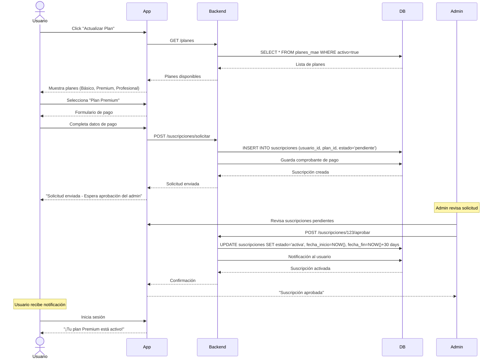

# 💳 FLUJO: SUSCRIPCIONES Y PLANES

## 🎯 Objetivo
Permitir que usuarios se suscriban a planes, actualicen su plan, y que el admin apruebe/gestione suscripciones.

---

## 📊 Diagrama de Flujo Principal

```
Usuario → Ver Planes → Seleccionar Plan → Pago → Espera Aprobación Admin → Activado
                                           │
                                           └─► Admin → Aprobar/Rechazar
```

---

## 🔄 Diagrama de Secuencia - Suscripción de Usuario



---

## 💰 PLANES DISPONIBLES

### Plan Básico (Gratis)
- ✅ 10 búsquedas al mes
- ✅ 1 registro de propiedad
- ✅ Favoritos ilimitados
- ❌ Sin alertas de búsqueda
- ❌ Sin soporte prioritario

### Plan Premium (S/ 49/mes)
- ✅ Búsquedas ilimitadas
- ✅ 5 registros de propiedades
- ✅ Favoritos ilimitados
- ✅ Alertas de búsqueda (diarias)
- ✅ Soporte prioritario
- ✅ Estadísticas avanzadas

### Plan Profesional (S/ 99/mes)
- ✅ Búsquedas ilimitadas
- ✅ Registros ilimitados
- ✅ Favoritos ilimitados
- ✅ Alertas de búsqueda (inmediatas)
- ✅ Soporte prioritario
- ✅ Estadísticas avanzadas
- ✅ Asignación de corredor
- ✅ Promoción destacada

---

## 👤 FLUJO: Usuario Solicita Suscripción

### Paso 1: Ver Planes Disponibles

**Pantalla:** `pages/usuario/planes.html`

```
┌─────────────────────────────────────────────────────────┐
│ 💳 PLANES Y SUSCRIPCIONES                               │
├─────────────────────────────────────────────────────────┤
│                                                         │
│ Tu plan actual: BÁSICO (Gratis)                        │
│ Búsquedas usadas: 7/10                                 │
│ Registros usados: 1/1                                  │
│                                                         │
│ ┌─────────────┐  ┌─────────────┐  ┌─────────────┐    │
│ │   BÁSICO    │  │   PREMIUM   │  │ PROFESIONAL │    │
│ │   Gratis    │  │  S/ 49/mes  │  │  S/ 99/mes  │    │
│ ├─────────────┤  ├─────────────┤  ├─────────────┤    │
│ │ • 10 búsq.  │  │ • Ilimitado │  │ • Ilimitado │    │
│ │ • 1 registro│  │ • 5 registros│ │ • Ilimitado │    │
│ │ • Favoritos │  │ • Favoritos │  │ • Favoritos │    │
│ │             │  │ • Alertas   │  │ • Alertas   │    │
│ │             │  │ • Soporte   │  │ • Corredor  │    │
│ │             │  │             │  │ • Destacado │    │
│ │             │  │             │  │             │    │
│ │ [Actual]    │  │ [Actualizar]│  │ [Actualizar]│    │
│ └─────────────┘  └─────────────┘  └─────────────┘    │
│                                                         │
└─────────────────────────────────────────────────────────┘
```

---

### Paso 2: Formulario de Pago

**Pantalla:** `pages/usuario/pago.html`

```
┌─────────────────────────────────────────────────────────┐
│ 💳 ACTUALIZAR A PLAN PREMIUM                            │
├─────────────────────────────────────────────────────────┤
│                                                         │
│ Plan seleccionado: PREMIUM                             │
│ Precio: S/ 49.00 / mes                                 │
│                                                         │
│ Método de pago:                                        │
│ (•) Transferencia Bancaria                             │
│ ( ) Yape / Plin                                        │
│ ( ) Tarjeta de crédito                                 │
│                                                         │
│ Datos de transferencia:                                │
│ ┌─────────────────────────────────────────────────┐   │
│ │ Banco: BCP                                       │   │
│ │ Cuenta: 123-456789-0-12                         │   │
│ │ CCI: 00212312345678901234                       │   │
│ │ Titular: Match Property SAC                     │   │
│ └─────────────────────────────────────────────────┘   │
│                                                         │
│ Subir comprobante de pago:                            │
│ [📎 Seleccionar archivo]                               │
│                                                         │
│ Número de operación:                                   │
│ [________________]                                     │
│                                                         │
│ [Enviar Solicitud]  [Cancelar]                        │
│                                                         │
└─────────────────────────────────────────────────────────┘
```

---

### Paso 3: Confirmación

```
┌─────────────────────────────────────────────────────────┐
│ ✅ SOLICITUD ENVIADA                                    │
├─────────────────────────────────────────────────────────┤
│                                                         │
│ Tu solicitud de suscripción al Plan Premium ha sido    │
│ enviada correctamente.                                 │
│                                                         │
│ Estado: PENDIENTE DE APROBACIÓN                        │
│                                                         │
│ El administrador revisará tu comprobante de pago y     │
│ activará tu plan en las próximas 24 horas.            │
│                                                         │
│ Recibirás una notificación cuando tu plan esté activo. │
│                                                         │
│ [Volver al Dashboard]                                  │
│                                                         │
└─────────────────────────────────────────────────────────┘
```

---

## 👑 FLUJO: Admin Gestiona Suscripciones

### Tab en Dashboard Admin: Suscripciones

**Pantalla:** `pages/admin/dashboard.html` (Tab 6: Suscripciones)

```
┌─────────────────────────────────────────────────────────┐
│ 💳 GESTIÓN DE SUSCRIPCIONES                             │
├─────────────────────────────────────────────────────────┤
│                                                         │
│ Filtros: [Pendientes ▼] [Todos los planes ▼] [Buscar] │
│                                                         │
│ ┌─────────────────────────────────────────────────────┐│
│ │ ID │ Usuario │ Plan │ Monto │ Estado │ Fecha │ Acc. ││
│ ├────┼─────────┼──────┼───────┼────────┼───────┼──────┤│
│ │ 15 │ Juan P. │Premium│S/ 49 │Pendiente│14/01 │[Ver] ││
│ │ 14 │ María L.│Profes.│S/ 99 │Activa  │12/01 │[Ver] ││
│ │ 13 │ Carlos R│Premium│S/ 49 │Rechazada│10/01│[Ver] ││
│ └─────────────────────────────────────────────────────┘│
│                                                         │
└─────────────────────────────────────────────────────────┘
```

---

### Detalle de Suscripción Pendiente

```
┌─────────────────────────────────────────────────────────┐
│ 💳 SUSCRIPCIÓN #15 - PENDIENTE                          │
├─────────────────────────────────────────────────────────┤
│                                                         │
│ Usuario: Juan Pérez (juan.perez@email.com)            │
│ Plan solicitado: PREMIUM (S/ 49/mes)                   │
│ Fecha solicitud: 14/01/2025 10:30 AM                   │
│                                                         │
│ Comprobante de pago:                                   │
│ ┌─────────────────────────────────────────────────┐   │
│ │ [Imagen del comprobante]                         │   │
│ │                                                  │   │
│ │ Número operación: 123456789                     │   │
│ │ Banco: BCP                                       │   │
│ │ Monto: S/ 49.00                                  │   │
│ └─────────────────────────────────────────────────┘   │
│                                                         │
│ Notas del admin:                                       │
│ [_________________________________________________]    │
│                                                         │
│ [✅ Aprobar]  [❌ Rechazar]  [Volver]                  │
│                                                         │
└─────────────────────────────────────────────────────────┘
```

---

## 📊 Registro en Base de Datos

### Solicitud de Suscripción

```sql
-- Usuario solicita plan
INSERT INTO suscripciones (
  usuario_id,
  plan_id,
  estado,
  comprobante_pago,
  numero_operacion,
  monto_pagado,
  fecha_solicitud
) VALUES (
  5,  -- Juan Pérez
  2,  -- Plan Premium
  'pendiente',
  'uploads/comprobantes/123456.jpg',
  '123456789',
  49.00,
  NOW()
);
```

---

### Admin Aprueba Suscripción

```sql
-- Admin aprueba
UPDATE suscripciones 
SET 
  estado = 'activa',
  fecha_inicio = NOW(),
  fecha_fin = NOW() + INTERVAL '30 days',
  aprobado_por = 1,  -- ID del admin
  fecha_aprobacion = NOW(),
  notas_admin = 'Comprobante validado correctamente'
WHERE suscripcion_id = 15;

-- Notificar al usuario
INSERT INTO notificaciones (
  usuario_id,
  tipo,
  titulo,
  mensaje,
  leido
) VALUES (
  5,
  'suscripcion_aprobada',
  '¡Tu plan Premium está activo!',
  'Tu suscripción ha sido aprobada. Ya puedes disfrutar de todos los beneficios.',
  false
);
```

---

### Admin Rechaza Suscripción

```sql
-- Admin rechaza
UPDATE suscripciones 
SET 
  estado = 'rechazada',
  aprobado_por = 1,
  fecha_aprobacion = NOW(),
  notas_admin = 'Comprobante no válido. Por favor, envía un comprobante legible.'
WHERE suscripcion_id = 15;

-- Notificar al usuario
INSERT INTO notificaciones (
  usuario_id,
  tipo,
  titulo,
  mensaje,
  leido
) VALUES (
  5,
  'suscripcion_rechazada',
  'Suscripción rechazada',
  'Tu solicitud fue rechazada. Motivo: Comprobante no válido.',
  false
);
```

---

## 🔄 Estados de Suscripción

| Estado | Descripción | Acciones Disponibles |
|--------|-------------|---------------------|
| `pendiente` | Esperando aprobación del admin | Aprobar, Rechazar |
| `activa` | Suscripción activa y vigente | Pausar, Cancelar |
| `expirada` | Suscripción venció | Renovar |
| `cancelada` | Usuario canceló | Reactivar |
| `rechazada` | Admin rechazó | Reenviar solicitud |

---

## 📋 Queries Útiles

### Ver suscripciones pendientes

```sql
SELECT 
  s.suscripcion_id,
  u.nombre_completo,
  u.email,
  p.nombre as plan,
  s.monto_pagado,
  s.numero_operacion,
  s.comprobante_pago,
  s.fecha_solicitud
FROM suscripciones s
JOIN usuarios u ON s.usuario_id = u.usuario_id
JOIN planes_mae p ON s.plan_id = p.plan_id
WHERE s.estado = 'pendiente'
ORDER BY s.fecha_solicitud ASC;
```

---

### Ver suscripciones activas por vencer

```sql
SELECT 
  s.suscripcion_id,
  u.nombre_completo,
  u.email,
  p.nombre as plan,
  s.fecha_fin,
  DATEDIFF(s.fecha_fin, NOW()) as dias_restantes
FROM suscripciones s
JOIN usuarios u ON s.usuario_id = u.usuario_id
JOIN planes_mae p ON s.plan_id = p.plan_id
WHERE s.estado = 'activa'
  AND s.fecha_fin <= NOW() + INTERVAL '7 days'
ORDER BY s.fecha_fin ASC;
```

---

## ✅ Validación con Tablas

- ✅ `suscripciones` - Tabla principal
- ✅ `planes_mae` - Planes disponibles
- ✅ `usuarios` - Usuarios
- ✅ Campos necesarios: `estado`, `comprobante_pago`, `numero_operacion`, `aprobado_por`, `notas_admin`

**Estado:** ✅ TABLA EXISTENTE - FLUJO COMPLETO DEFINIDO
